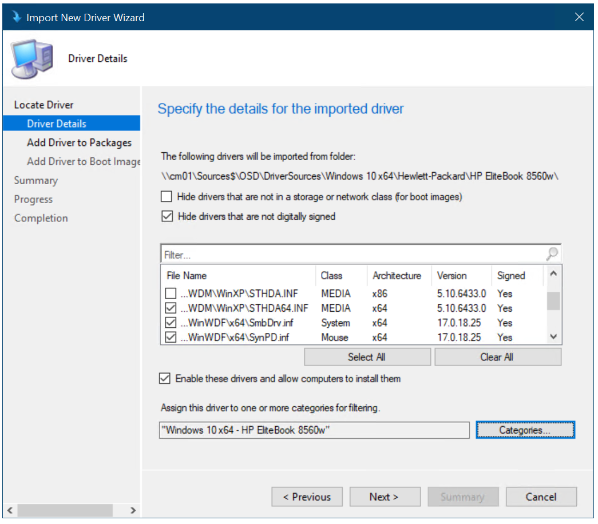

# Add drivers to a Windows 10 deployment with Windows PE using Configuration Manager

**Applies to**

-   Windows 10

----start here and edit------------

In this topic, you will learn how to configure the Windows Preinstallation Environment (Windows PE) to include the network drivers required to connect to the deployment share and the storage drivers required to see the local storage on machines. Even though the Windows PE boot image and the Windows 10 operating system contain many out-of-the-box drivers, it is likely you will have to add new or updated drivers to support all your hardware. In this section, you import drivers for both Windows PE and the full Windows 10 operating system.

For the purposes of this guide, we will use one server computer: CM01.
- CM01 is a domain member server and Configuration Manager software distribution point. In this guide CM01 is a standalone primary site server. CM01 is running Windows Server 2019. However, an earlier, supported version of Windows Server can also be used. 

## Add drivers for Windows PE

This section will show you how to import some network and storage drivers for Windows PE. This section assumes you have downloaded some drivers to the E:\\Sources\\OSD\\DriverSources\\WinPE x64 folder on CM01.

1.  On CM01, using the Configuration Manager Console, in the Software Library workspace, right-click the **Drivers** node and select **Import Driver**.
2.  In the Import New Driver Wizard, on the **Specify a location to import driver** page, below the Import all drivers in the following network path (UNC) option, browse to the **\\\\CM01\\Sources$\\OSD\\DriverSources\\WinPE x64** folder and click **Next**.
3.  On the **Specify the details for the imported driver** page, click **Categories**, create a category named **WinPE x64**, and then click **Next**.
4.  On the **Select the packages to add the imported driver** page, click **Next**.
5.  On the **Select drivers to include in the boot image** page, select the **Zero Touch WinPE x64** boot image. Also select the **Update distribution points when finished** check box, and click **Next** twice.

Add drivers to Windows PE

>[!NOTE]
>The Updating Boot Image part of the wizard will appear to hang when displaying Done. It will complete in a minute or two.
 
## Add drivers for Windows 10

This section illustrates how to add drivers for Windows 10 through an example in which you want to import Windows 10 drivers for the HP EliteBook 8560w model. For the purposes of this section, we assume that you have downloaded the Windows 10 drivers for the HP EliteBook 8560w model and copied them to the E:\\Sources\\OSD\\DriverSources\\Windows 10 x64\\HP EliteBook 8560w folder on CM01.

1.  On CM01, using the Configuration Manager Console, right-click the **Drivers** folder and select **Import Driver**.
2.  In the Import New Driver Wizard, on the **Specify a location to import driver** page, below the Import all drivers in the following network path (UNC) option, browse to the **\\\\CM01\\Sources$\\OSD\\DriverSources\\Windows 10 x64\\HP EliteBook 8560w** folder and click **Next**.
3.  On the **Specify the details for the imported driver** page, click **Categories**, create a category named Windows 10 x64 - HP EliteBook 8560w, and then click **Next**.

    

    Create driver categories

4.  On the **Select the packages to add the imported driver** page, click **New Package**, use the following settings for the package, and then click **Next**:

    * Name: Windows 10 x64 - HP EliteBook 8560w
    * Path: \\\\CM01\\Sources$\\OSD\\DriverPackages\\Windows 10 x64\\HP EliteBook 8560w

    >[!NOTE]
    >The package path does not yet exist, so you have to type it in. The wizard will create the new package in that folder.

5.  On the **Select drivers to include in the boot image** page, do not select anything, and click **Next** twice. After the package has been created, click **Close**.

    >[!NOTE]
    >If you want to monitor the driver import process more closely, you can open the SMSProv.log file during driver import.
  
    
  
    Drivers imported and a new driver package created

## Related topics

[Prepare for Zero Touch Installation of Windows 10 with Configuration Manager](prepare-for-zero-touch-installation-of-windows-10-with-configuration-manager.md) 
[Create a custom Windows PE boot image with Configuration Manager](create-a-custom-windows-pe-boot-image-with-configuration-manager.md) 
[Add a Windows 10 operating system image using Configuration Manager](add-a-windows-10-operating-system-image-using-configuration-manager.md) 
[Create an application to deploy with Windows 10 using Configuration Manager](create-an-application-to-deploy-with-windows-10-using-configuration-manager.md) 
[Create a task sequence with Configuration Manager and MDT](../deploy-windows-mdt/create-a-task-sequence-with-configuration-manager-and-mdt.md) 
[Deploy Windows 10 using PXE and Configuration Manager](deploy-windows-10-using-pxe-and-configuration-manager.md) 
[Refresh a Windows 7 SP1 client with Windows 10 using Configuration Manager](refresh-a-windows-7-client-with-windows-10-using-configuration-manager.md) 
[Replace a Windows 7 SP1 client with Windows 10 using Configuration Manager](replace-a-windows-7-client-with-windows-10-using-configuration-manager.md) 
