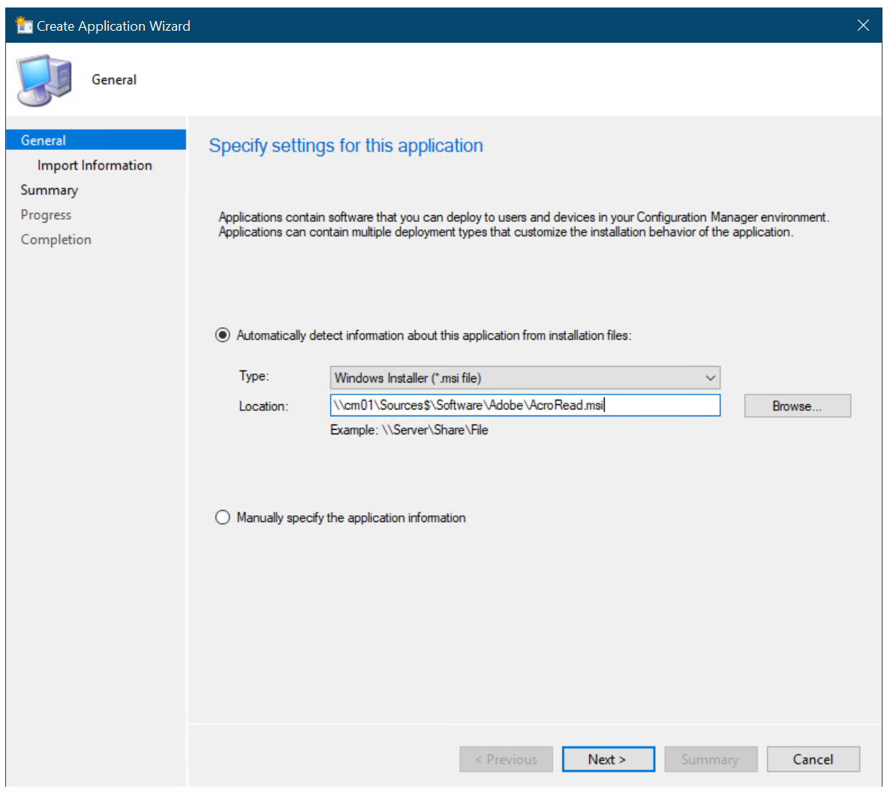
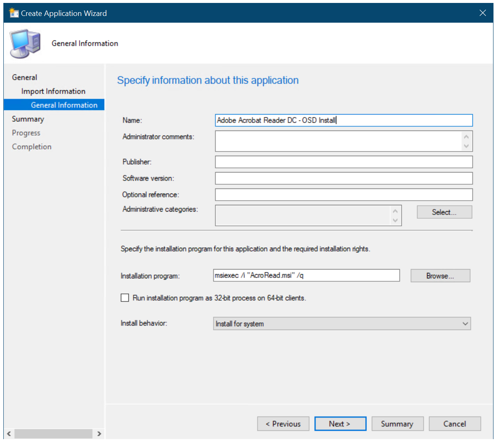

# Create an application to deploy with Windows 10 using Configuration Manager


**Applies to**

-   Windows 10

Microsoft Endpoint Configuration Manager supports deploying applications as part of the Windows 10 deployment process. In this section, you create an application in Microsoft Endpoint Configuration Manager that you later configure the task sequence to use.

For the purposes of this guide, we will use one server computer: CM01.
- CM01 is a domain member server and Configuration Manager software distribution point. In this guide CM01 is a standalone primary site server. CM01 is running Windows Server 2019. However, an earlier, supported version of Windows Server can also be used. 

>[!NOTE]
>The [reference image](add-a-windows-10-operating-system-image-using-configuration-manager.md) used in this lab already contains some applications, such as Microsoft Office 365 Pro Plus x64. The procedure demonstrated in this article enables you to add some additional custom applications beyond those included in the reference image.

## Example: Create the Adobe Reader application

On **CM01**:

1. Create the **D:\Setup** folder if it does not already exist.
1. Download the Enterprise distribution version of [Adobe Acrobat Reader DC](https://get.adobe.com/reader/enterprise/) (ex: AcroRdrDC2000620034_en_US.exe.exe) to **D:\\Setup\\Adobe** on CM01. The filename will differ depending on the version of Acrobat Reader.
2. Extract the .exe file that you downloaded to an .msi. The source folder will differ depending on where you downloaded the file. See the following example:

  ```powershell
  Set-Location C:\Users\administrator.CONTOSO\Downloads
  .\AcroRdrDC2000620034_en_US.exe -sfx_o"d:\Setup\Adobe\" -sfx_ne
  ```
  >Note: the extraction process will create the "Adobe" folder

3.  Using File Explorer, copy the **D:\\Setup\\Adobe** folder to the **D:\\Sources\\Software\\Adobe** folder.
4.  In the Configuration Manager Console, in the Software Library workspace, expand **Application Management**.
5.  Right-click **Applications**, point to **Folder** and then click **Create Folder**. Assign the name **OSD**.
6.  Right-click the **OSD** folder, and click **Create Application**.
7.  In the Create Application Wizard, on the **General** page, use the following settings:

    * Automatically detect information about this application from installation files
    * Type: Windows Installer (\*.msi file)
    * Location: \\\\CM01\\Sources$\\Software\\Adobe\\AcroRead.msi

    

    The Create Application Wizard

8.  Click **Next**, and wait while Configuration Manager parses the MSI file.
9.  On the **Import Information** page, review the information and then click **Next**.
10.  On the **General Information** page, name the application Adobe Acrobat Reader DC - OSD Install, click **Next** twice, and then click **Close**.

  >[!NOTE]
  >Because it is not possible to reference an application deployment type in the task sequence, you should have a single deployment type for applications deployed by the task sequence. If you are deploying applications via both the task sequence and normal application deployment, and you have multiple deployment types, you should have two applications of the same software. In this section, you add the "OSD Install" suffix to applications that are deployed via the task sequence. If using packages, you can still reference both package and program in the task sequence.
  
  
  
  Add the "OSD Install" suffix to the application name

11.  In the **Applications** node, select the Adobe Reader - OSD Install application, and click **Properties** on the ribbon bar (this is another place to view properties, you can also right-click and select properties).
12. On the **General Information** tab, select the **Allow this application to be installed from the Install Application task sequence action without being deployed** check box, and click **OK**.

Next, see [Add drivers to a Windows 10 deployment with Windows PE using Configuration Manager](add-drivers-to-a-windows-10-deployment-with-windows-pe-using-configuration-manager.md). 

## Related topics

[Prepare for Zero Touch Installation of Windows 10 with Configuration Manager](prepare-for-zero-touch-installation-of-windows-10-with-configuration-manager.md)<br>
[Create a custom Windows PE boot image with Configuration Manager](create-a-custom-windows-pe-boot-image-with-configuration-manager.md)<br>
[Add a Windows 10 operating system image using Configuration Manager](add-a-windows-10-operating-system-image-using-configuration-manager.md)<br>
[Add drivers to a Windows 10 deployment with Windows PE using Configuration Manager](add-drivers-to-a-windows-10-deployment-with-windows-pe-using-configuration-manager.md)<br>
[Create a task sequence with Configuration Manager and MDT](../deploy-windows-mdt/create-a-task-sequence-with-configuration-manager-and-mdt.md)<br>
[Deploy Windows 10 using PXE and Configuration Manager](deploy-windows-10-using-pxe-and-configuration-manager.md)<br>
[Refresh a Windows 7 SP1 client with Windows 10 using Configuration Manager](refresh-a-windows-7-client-with-windows-10-using-configuration-manager.md)<br>
[Replace a Windows 7 SP1 client with Windows 10 using Configuration Manager](replace-a-windows-7-client-with-windows-10-using-configuration-manager.md)<br>
